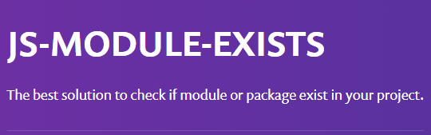
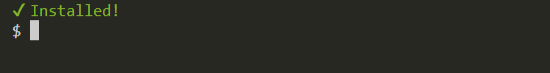
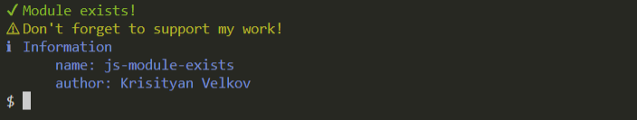

# js-module-exists

[](https://github.com/christiyan14) [](https://github.com/christiyan14) [](https://choosealicense.com/licenses/mit/) [](https://nodejs.org/en/)



**Checks if an es module/ npm package exists and returns a boolean value.**
**Also you can provide a nice terminal message which can be customized as you like.**

## Table of contents

- [Installation 🦾](#installation)
- [How to Use? 💻](#how-to-use)
- [Examples 🚀](#examples)
- [Developer Support 🔗 ](#developer-support)
- [Support my work ❤️ ](#buy-me-a-coffee)

---

## Installation

- Via npm:

```code
npm install js-module-exists --save-dev

```

- Via yarn:

```code
yarn add js-module-exists -D

```

## How to use?

#### API

| Method                     | Usage                                                                                                                                     |
| -------------------------- | ----------------------------------------------------------------------------------------------------------------------------------------- |
| **moduleExists()**         | Еasy to use a method that will return a boolean value after checking the module/ npm package.                                             |
| **moduleExistsWithText()** | Will return a boolean value if the module/ package exists. Also will provide a nice terminal message which can be customized as you like. |
| **setTextColors()**        | Sets default text colors for success, error, warn, and info messages. **Used only with moduleExistsWithText() method.**                   |

1. **moduleExists() method**

- Accepts string and returns a boolean value.

```js
import { moduleExists } from "js-module-exists";

if (moduleExists("some-npm-package-name")) {
  //=> true
} else {
  //=> false
}
```

2. **moduleExistsWithText() method**

   - **Info:** Easy to use fully customizable method for checking if the module/npm package exists. Coming with default terminal response. The message in the console (color, text ) can be changed to whatever value you want.

| Properties | Description                     | Return value |
| ---------- | ------------------------------- | ------------ |
| moduleName | module, npm package name        | boolean      |
| options    | Custamizable terminal response. | object       |

```js
import { moduleExistsWithText } from "js-module-exists";

moduleExistsWithText("some-npm-package-name");
```



- with options

```js
import { moduleExistsWithText } from "js-module-exists";

moduleExistsWithText("some-npm-package-name", {
  success: {
    text: "Module exists!",
    warn: {
      text: "Don't forget to support my work!",
    },
    info: {
      text: `Information
      name: js-module-exists
      author: Krisityan Velkov`,
    },
  },
});
```



## Examples:

Full lists of examples how to use **js-module-exists** whit all supported options:

- [Readme file](https://github.com/christiyan14/js-module-exists/blob/main/examples/Examples.md)

- [JS file](https://github.com/christiyan14/js-module-exists/blob/main/examples/example.js)

## Developer Support:

- If you saw some issue/bug 🐛 related to the specific release version.
- If you want some new feature or change to be added/implemented. 😊

Please, contact the creator of the **js-module-exists**, so he will be able to fix or improve it:

**Kristiyan Velkov**

**Email:** christiyanweb@gmail.com

[](https://www.linkedin.com/in/kristiyan-velkov-763130b3/)

[](https://github.com/christiyan14)

## Buy me a coffee

If you like my work and want to support me to work hard, please:

Donate via Revolut QR code


or

<a href="https://www.buymeacoffee.com/kristiyanvelkov" target="_blank"></a>

Thanks a bunch for supporting me! It means a LOT 😍

---

Copyright ©️2022. All rights reserved.
